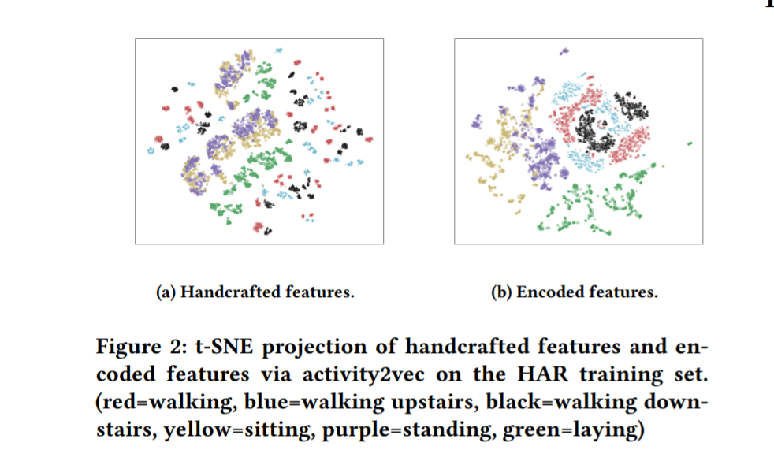

# Download_Project
Collections of resources and thoughts for Download Project.

## Overview

### [Sensor-based, single-user activity recognition](https://en.wikipedia.org/wiki/Activity_recognition#Sensor-based,_single-user_activity_recognition)

*Levels of sensor-based activity recognition*

- At the lowest level where the sensor data are collected, statistical learning concerns how to find the detailed locations of agents from the received signal data.
- At an intermediate level, statistical inference may be concerned about how to recognize individuals' activities
from the inferred location sequences and environmental conditions at the lower levels.
- at the highest level a major concern is to find out the overall goal or subgoals of an agent from the activity sequences
through a mixture of logical and statistical reasoning.

## Resources

### [Human Activity Recognition Dataset](https://archive.ics.uci.edu/ml/datasets/human+activity+recognition+using+smartphones#)

**Feature Selection**

The sensor signals (accelerometer and gyroscope) were pre-processed by applying noise filters and then sampled in **fixed-width sliding windows of 2.56 sec and 50% overlap (128 readings/window)**. The sensor acceleration signal, which has gravitational and body motion components, was separated using a **Butterworth low-pass filter** into body acceleration and gravity. The gravitational force is assumed to have only low frequency components, therefore a filter with 0.3 Hz cutoff frequency was used. From each window, a vector of features was obtained by calculating variables from the time and frequency domain.

The features selected for this database come from the accelerometer and gyroscope 3-axial raw signals tAcc-XYZ and tGyro-XYZ. These time domain signals (prefix 't' to denote time) were captured at a constant rate of 50 Hz. Then they were filtered using a **median filter and a 3rd order low pass Butterworth filter with a corner frequency of 20 Hz to remove noise**. Similarly, the acceleration signal was then separated into body and gravity acceleration signals (tBodyAcc-XYZ and tGravityAcc-XYZ) using another **low pass Butterworth filter with a corner frequency of 0.3 Hz**. 

Subsequently, the body linear acceleration and angular velocity were derived in time to obtain Jerk signals (tBodyAccJerk-XYZ and tBodyGyroJerk-XYZ). Also the magnitude of these three-dimensional signals were calculated using the Euclidean norm (tBodyAccMag, tGravityAccMag, tBodyAccJerkMag, tBodyGyroMag, tBodyGyroJerkMag). 

Finally a **Fast Fourier Transform (FFT)** was applied to some of these signals producing fBodyAcc-XYZ, fBodyAccJerk-XYZ, fBodyGyro-XYZ, fBodyAccJerkMag, fBodyGyroMag, fBodyGyroJerkMag. (Note the 'f' to indicate frequency domain signals).

### [Activity2Vec](https://arxiv.org/pdf/1907.05597.pdf)

**Method**

We implemented the activity2vec model with Keras. The
encoder is a single-layered bidirectional LSTM and the decoder is a
single-layered unidirectional LSTM. By employing a bidirectional
LSTM as the encoder, the activity2vec model is able to preserve information from both past and future. We also observe that imposing
a L1 norm penalty on the encoder helps it to learn a better representation of zi. The reason behind applying the L1 norm penalty is to penalize the less impactful features of the encoded representation zi in reconstruction of sequence si. During training, we added Gaussian noise to the input to make the activity2vec model indifferent
to small changes. In our experiments, we trained the activity2vec
model by applying the Adam optimizer for 1000 epochs. Once
this is done, the trained encoder can be used to generate sensor
embedding zi for each sequence si.

**Results**

<!-- .element height="20%" width="20%" -->

### [Human Activity Recognition Time Series Classification](https://machinelearningmastery.com/how-to-develop-rnn-models-for-human-activity-recognition-time-series-classification/)

### [epSICAR ](https://s3.amazonaws.com/academia.edu.documents/42912149/epSICAR_An_Emerging_Patterns_based_Appro20160221-11761-emcy59.pdf)

### [Activity Recognition Experiment Using Smartphone Sensors](https://www.youtube.com/watch?v=XOEN9W05_4A)
